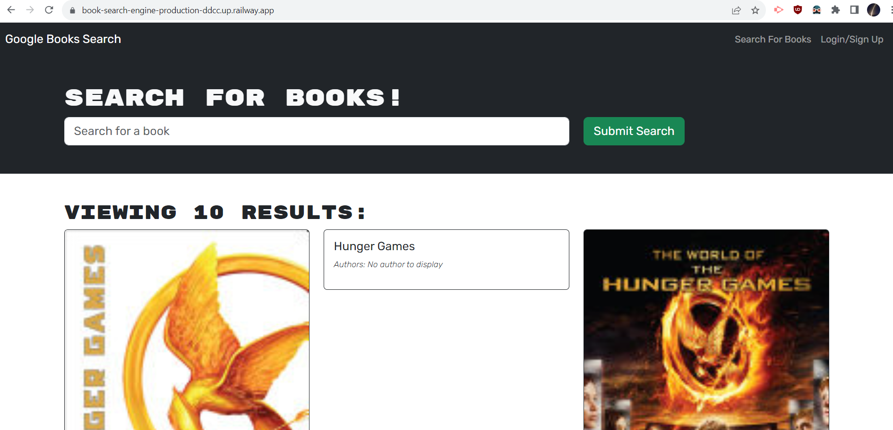

# Google API Book Search Engine
                

## Description
This app is the result of taking an already functioning react app that used a RESTful API to search, saved, store and render book data searched against Google's book search API, and refactoring it to entirely use GraphQL queries and mutations instead. The result is a MERN full stack app.        

The old RESTful API code is still left intact(most of it commented out) so a comparison can be made and one can see that the app is functioning in the same way and manner as MERN stack vs a RESTful API based one.

## Installation
To install, simply clone repo anywhere. Navigate to the repo, and install dev dependencies with 

`npm install`     

Then, install necessary packages for both server and client with the npm script

`npm run install`

Once complete, build the react app with 

`npm run build`    

Start the dev server and  react client concurrently by running 

`npm run develop`

## Usage
To use the book search engine, simply use the search field to search for any book or author. The app will fetch the query against the Google Books API, and display the results on the page. To save/favorite a book for future use, you'll first have to create an account. Once created, you will be able to save individual book results to your account. You can view them later by navigating to the 'saved books' tab. You will also have to be logged in here to see them.

Link to project repository: [https://github.com/jrapich/book-search-engine](https://github.com/jrapich/book-search-engine)

Link to the deployed application: [https://book-search-engine-production-ddcc.up.railway.app/](https://book-search-engine-production-ddcc.up.railway.app/)

Screenshot of the application:

## Tests
none needed

## Credits
no other contributors

## Contributing
How to contribute:

Please reach out to me at jeremysr@protonmail.com or make a pull request at 

[https://github.com/jrapich/book-search-engine](https://github.com/jrapich/book-search-engine)

## Questions?
Any further questions, comments, or bug reports, can be sent to me at jeremysr@protonmail.com

https://www.github.com/jrapich

## License
This project protected under MIT License.

All rights reserved. See /LICENSE for more information.

